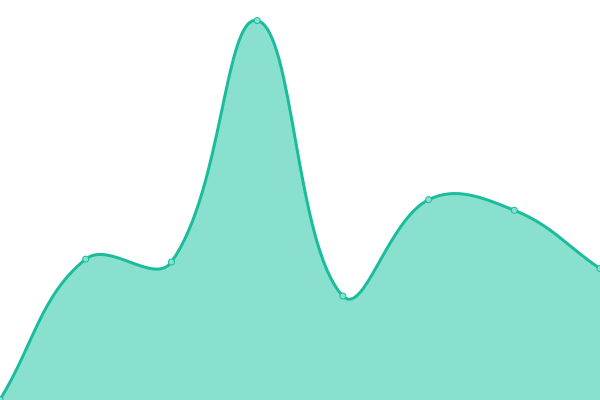
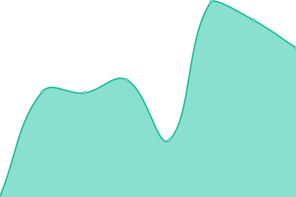
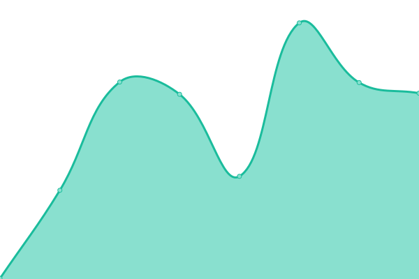
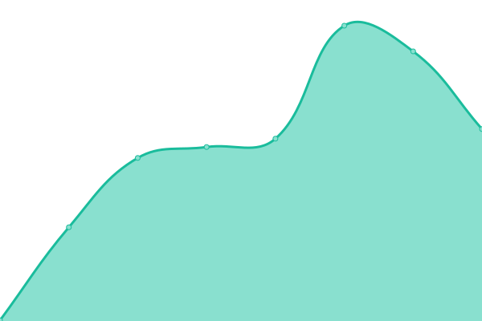

# [📈 Live Status](https://j-ranck-electric.github.io/upptime): <!--live status--> **🟧 Partial outage**

This repository contains the open-source uptime monitor and status page for [J. Ranck Electric Inc.](https://jranck.com), powered by [Upptime](https://github.com/upptime/upptime).

With [Upptime](https://upptime.js.org), you can get your own unlimited and free uptime monitor and status page, powered entirely by a GitHub repository. We use [Issues](https://github.com/j-ranck-electric/upptime/issues) as incident reports, [Actions](https://github.com/j-ranck-electric/upptime/actions) as uptime monitors, and [Pages](https://j-ranck-electric.github.io/upptime) for the status page.

<!--start: status pages-->
<!-- This summary is generated by Upptime (https://github.com/upptime/upptime) -->
<!-- Do not edit this manually, your changes will be overwritten -->
<!-- prettier-ignore -->
| URL | Status | History | Response Time | Uptime |
| --- | ------ | ------- | ------------- | ------ |
|  [JRE Documentation](https://docs.jranck.com) | 🟩 Up | [jre-documentation.yml](https://github.com/J-Ranck-Electric/upptime/commits/HEAD/history/jre-documentation.yml) | 

 497ms
     
 | 

<a href="https://status.jranck.com/history/jre-documentation">100.00%</a>
    

|  [Fore the Kids](https://forethekids.jranck.com) | 🟩 Up | [fore-the-kids.yml](https://github.com/J-Ranck-Electric/upptime/commits/HEAD/history/fore-the-kids.yml) | 

 219ms
     
 | 

<a href="https://status.jranck.com/history/fore-the-kids">100.00%</a>
    

|  [HR App](https://hr.jranck.com) | 🟩 Up | [hr-app.yml](https://github.com/J-Ranck-Electric/upptime/commits/HEAD/history/hr-app.yml) | 

 484ms
     
 | 

<a href="https://status.jranck.com/history/hr-app">100.00%</a>
    

|  [Onboarding App](https://onboarding.jranck.com) | 🟩 Up | [onboarding-app.yml](https://github.com/J-Ranck-Electric/upptime/commits/HEAD/history/onboarding-app.yml) | 

 229ms
     
 | 

<a href="https://status.jranck.com/history/onboarding-app">100.00%</a>
    

|  [Operations App](https://operations.jranck.com) | 🟩 Up | [operations-app.yml](https://github.com/J-Ranck-Electric/upptime/commits/HEAD/history/operations-app.yml) | 

 355ms
     
 | 

<a href="https://status.jranck.com/history/operations-app">100.00%</a>
    

|  [PTE App](https://pte.jranck.com) | 🟩 Up | [pte-app.yml](https://github.com/J-Ranck-Electric/upptime/commits/HEAD/history/pte-app.yml) | 

 331ms
     
 | 

<a href="https://status.jranck.com/history/pte-app">100.00%</a>
    

|  [Safety App](https://safety.jranck.com) | 🟩 Up | [safety-app.yml](https://github.com/J-Ranck-Electric/upptime/commits/HEAD/history/safety-app.yml) | 

 333ms
     
 | 

<a href="https://status.jranck.com/history/safety-app">100.00%</a>
    

|  [Warehouse App](https://warehouse.jranck.com) | 🟩 Up | [warehouse-app.yml](https://github.com/J-Ranck-Electric/upptime/commits/HEAD/history/warehouse-app.yml) | 

 324ms
     
 | 

<a href="https://status.jranck.com/history/warehouse-app">100.00%</a>
    

|  [Solar Safety Trainings](https://glstc.jranck.com) | 🟩 Up | [solar-safety-trainings.yml](https://github.com/J-Ranck-Electric/upptime/commits/HEAD/history/solar-safety-trainings.yml) | 

 217ms
     
 | 

<a href="https://status.jranck.com/history/solar-safety-trainings">100.00%</a>
    

|  [JRE Store](https://store.jranck.com) | 🟥 Down | [jre-store.yml](https://github.com/J-Ranck-Electric/upptime/commits/HEAD/history/jre-store.yml) | 

 517ms
     
 | 

<a href="https://status.jranck.com/history/jre-store">100.00%</a>
    

|  [app.jranck.com](https://app.jranck.com) | 🟩 Up | [app-jranck-com.yml](https://github.com/J-Ranck-Electric/upptime/commits/HEAD/history/app-jranck-com.yml) | 

 212ms
     
 | 

<a href="https://status.jranck.com/history/app-jranck-com">100.00%</a>
    

|  [API](https://api.jranck.com/permissions/anontest) | 🟩 Up | [api.yml](https://github.com/J-Ranck-Electric/upptime/commits/HEAD/history/api.yml) | 

 199ms
     
 | 

<a href="https://status.jranck.com/history/api">100.00%</a>
    

<!--end: status pages-->

[**Visit our status website →**](https://j-ranck-electric.github.io/upptime)

## 📄 License

- Powered by: [Upptime](https://github.com/upptime/upptime)
- Code: [MIT](./LICENSE) © [Anand Chowdhary](https://anandchowdhary.com), supported by [Pabio](https://pabio.com)
- Data in the `./history` directory: [Open Database License](https://opendatacommons.org/licenses/odbl/1-0/)
