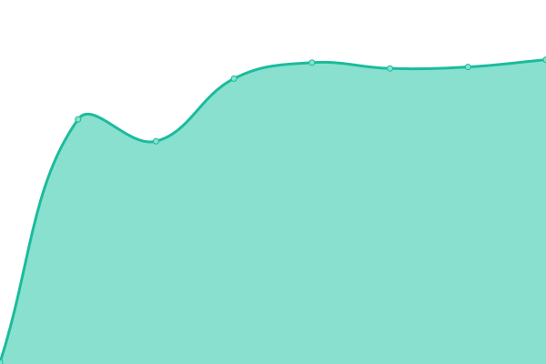

# [📈 Live Status](https://j-ranck-electric.github.io/upptime): <!--live status--> **🟩 All systems operational**

This repository contains the open-source uptime monitor and status page for [J. Ranck Electric Inc.](https://jranck.com), powered by [Upptime](https://github.com/upptime/upptime).

With [Upptime](https://upptime.js.org), you can get your own unlimited and free uptime monitor and status page, powered entirely by a GitHub repository. We use [Issues](https://github.com/j-ranck-electric/upptime/issues) as incident reports, [Actions](https://github.com/j-ranck-electric/upptime/actions) as uptime monitors, and [Pages](https://j-ranck-electric.github.io/upptime) for the status page.

<!--start: status pages-->
<!-- This summary is generated by Upptime (https://github.com/upptime/upptime) -->
<!-- Do not edit this manually, your changes will be overwritten -->
<!-- prettier-ignore -->
| URL | Status | History | Response Time | Uptime |
| --- | ------ | ------- | ------------- | ------ |
|  [jranck.com](https://jranck.com) | 🟩 Up | [jranck-com.yml](https://github.com/J-Ranck-Electric/upptime/commits/HEAD/history/jranck-com.yml) | 

 1385ms
     
 | 

<a href="https://j-ranck-electric.github.io/upptime/history/jranck-com">100.00%</a>
    

|  [Spectrum Web App](https://jranck.dexterchaney.com) | 🟩 Up | [spectrum-web-app.yml](https://github.com/J-Ranck-Electric/upptime/commits/HEAD/history/spectrum-web-app.yml) | 

 164ms
     
 | 

<a href="https://j-ranck-electric.github.io/upptime/history/spectrum-web-app">100.00%</a>
    

|  [app.jranck.com](https://app.jranck.com) | 🟩 Up | [app-jranck-com.yml](https://github.com/J-Ranck-Electric/upptime/commits/HEAD/history/app-jranck-com.yml) | 

 236ms
     
 | 

<a href="https://j-ranck-electric.github.io/upptime/history/app-jranck-com">100.00%</a>
    

|  [api.jranck.com](https://api.jranck.com/permissions/anontest) | 🟩 Up | [api-jranck-com.yml](https://github.com/J-Ranck-Electric/upptime/commits/HEAD/history/api-jranck-com.yml) | 

 251ms
     
 | 

<a href="https://j-ranck-electric.github.io/upptime/history/api-jranck-com">21.40%</a>
    

|  [docs.jranck.com](https://docs.jranck.com) | 🟩 Up | [docs-jranck-com.yml](https://github.com/J-Ranck-Electric/upptime/commits/HEAD/history/docs-jranck-com.yml) | 

 532ms
     
 | 

<a href="https://j-ranck-electric.github.io/upptime/history/docs-jranck-com">100.00%</a>
    

|  [forethekids.jranck.com](https://forethekids.jranck.com) | 🟩 Up | [forethekids-jranck-com.yml](https://github.com/J-Ranck-Electric/upptime/commits/HEAD/history/forethekids-jranck-com.yml) | 

 227ms
     
 | 

<a href="https://j-ranck-electric.github.io/upptime/history/forethekids-jranck-com">100.00%</a>
    

|  [hr.jranck.com](https://hr.jranck.com) | 🟩 Up | [hr-jranck-com.yml](https://github.com/J-Ranck-Electric/upptime/commits/HEAD/history/hr-jranck-com.yml) | 

 417ms
     
 | 

<a href="https://j-ranck-electric.github.io/upptime/history/hr-jranck-com">100.00%</a>
    

|  [onboarding.jranck.com](https://onboarding.jranck.com) | 🟩 Up | [onboarding-jranck-com.yml](https://github.com/J-Ranck-Electric/upptime/commits/HEAD/history/onboarding-jranck-com.yml) | 

 182ms
     
 | 

<a href="https://j-ranck-electric.github.io/upptime/history/onboarding-jranck-com">100.00%</a>
    

|  [operations.jranck.com](https://operations.jranck.com) | 🟩 Up | [operations-jranck-com.yml](https://github.com/J-Ranck-Electric/upptime/commits/HEAD/history/operations-jranck-com.yml) | 

 316ms
     
 | 

<a href="https://j-ranck-electric.github.io/upptime/history/operations-jranck-com">100.00%</a>
    

|  [pte.jranck.com](https://pte.jranck.com) | 🟩 Up | [pte-jranck-com.yml](https://github.com/J-Ranck-Electric/upptime/commits/HEAD/history/pte-jranck-com.yml) | 

 306ms
     
 | 

<a href="https://j-ranck-electric.github.io/upptime/history/pte-jranck-com">100.00%</a>
    

|  [safety.jranck.com](https://safety.jranck.com) | 🟩 Up | [safety-jranck-com.yml](https://github.com/J-Ranck-Electric/upptime/commits/HEAD/history/safety-jranck-com.yml) | 

 295ms
     
 | 

<a href="https://j-ranck-electric.github.io/upptime/history/safety-jranck-com">100.00%</a>
    

|  [warehouse.jranck.com](https://warehouse.jranck.com) | 🟩 Up | [warehouse-jranck-com.yml](https://github.com/J-Ranck-Electric/upptime/commits/HEAD/history/warehouse-jranck-com.yml) | 

 275ms
     
 | 

<a href="https://j-ranck-electric.github.io/upptime/history/warehouse-jranck-com">100.00%</a>
    

|  [glstc.jranck.com](https://glstc.jranck.com) | 🟩 Up | [glstc-jranck-com.yml](https://github.com/J-Ranck-Electric/upptime/commits/HEAD/history/glstc-jranck-com.yml) | 

 179ms
     
 | 

<a href="https://j-ranck-electric.github.io/upptime/history/glstc-jranck-com">100.00%</a>
    

|  [store.jranck.com](https://store.jranck.com) | 🟩 Up | [store-jranck-com.yml](https://github.com/J-Ranck-Electric/upptime/commits/HEAD/history/store-jranck-com.yml) | 

 436ms
     
 | 

<a href="https://j-ranck-electric.github.io/upptime/history/store-jranck-com">100.00%</a>
    

<!--end: status pages-->

[**Visit our status website →**](https://j-ranck-electric.github.io/upptime)

## 📄 License

- Powered by: [Upptime](https://github.com/upptime/upptime)
- Code: [MIT](./LICENSE) © [Anand Chowdhary](https://anandchowdhary.com), supported by [Pabio](https://pabio.com)
- Data in the `./history` directory: [Open Database License](https://opendatacommons.org/licenses/odbl/1-0/)
